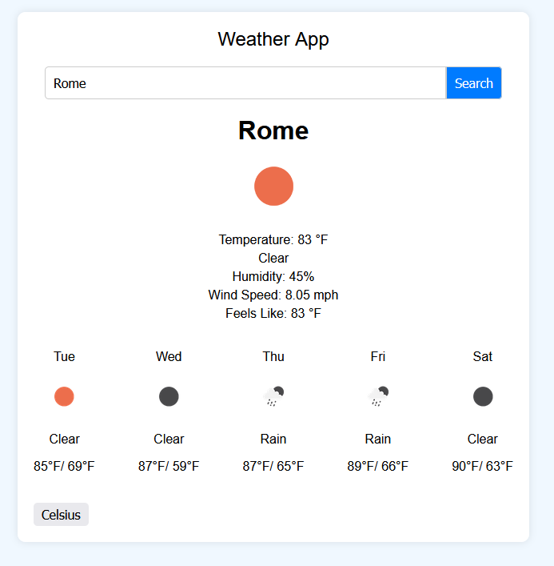

# Weather App



## Table of Contents
1. [Overview](#overview)
2. [Features](#features)
3. [File Structure](#file-structure)
4. [Technologies Used](#technologies-used)
5. [Setup and Installation](#setup-and-installation)
6. [API Refrence](#api-reference)
7. [Contributing](#contributing)


## Overview

The Weather App is a simple and intuitive application that allows users to search for current weather conditions and a 5-day forecast for any city. The app provides real-time weather data, including temperature, humidity, and wind speed, presented with easy-to-understand icons and descriptions.

## Features

- **Search for Weather by City**: Enter a city name to get the current weather and 5-day forecast.
- **Current Weather Conditions**: Displays temperature, weather description, humidity, wind speed, and feels-like temperature.
- **5-Day Forecast**: View the weather forecast for the next 5 days, including high/low temperatures and weather conditions.
- **Temperature Unit Toggle**: Switch between Celsius and Fahrenheit.
- **Responsive Design**: Optimized for desktop and mobile devices.

## File Structure

```plaintext
weather-app/
│
├── index.html              # Main HTML file
├── styles.css              # Main CSS file for styling
├── script.js               # Main JavaScript file for functionality
├── README.md               # Project documentation
```


## Technologies Used

- **HTML5:** Structure and content of the app.
- **CSS3:** Styling and layout (using Flexbox and Grid).
- **JavaScript:** Functionality and interactivity.
- **OpenWeather API:** Fetching weather data.


## Setup and Installation

To run the Weather App locally, follow these steps:

Clone the repository:

```bash

git clone https://github.com/AlexCrogh/WeatherApp.git
cd weather-app
```

Open the index.html file:
You can simply open the index.html file in your web browser to run the app.

(Optional) Use a local server:
If you want to run the app on a local server, you can use tools like live-server:

```bash

    npm install -g live-server
    live-server
```

Usage
Search for a city: Enter the name of a city in the search bar and press enter.
View weather data: The app will display the current weather and a 5-day forecast for the selected city.

## API Reference

The Weather App uses the OpenWeatherMap API to fetch weather data.

Base URL: https://openweathermap.org

## Contributing

Contributions are welcome! If you'd like to contribute to the Weather App, please follow these steps:

Fork the repository.
Create a new branch for your feature (git checkout -b feature-branch).
Commit your changes (git commit -m 'Add new feature').
Push to the branch (git push origin feature-branch).
Create a Pull Request.

